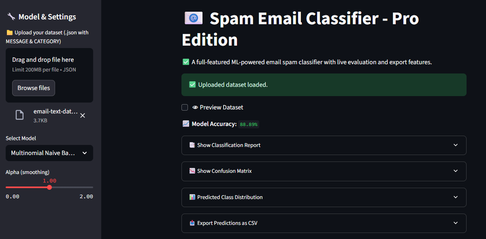

# 📧 Spam Email Classifier - Pro Edition

A powerful, production-ready, ML-powered Streamlit web app for classifying email text as **Spam** or **Ham**. Live evaluation, user-friendly interface, multiple model options, export features \& elegant reporting — all in a single click!

***

## 🚀 Features

- **Instant Spam Detection**: Paste or upload email messages for lightning-fast classification.
- **Interactive Model Selection**: Choose from Naive Bayes, Logistic Regression, or Linear SVM.
- **Hyperparameter Control**: Adjust model settings for best results.
- **Data Insights**: See accuracy, confusion matrix, and a classification report live.
- **Easy Exports**: Download results as CSV for further analysis.
- **No Code Required**: Everything works in your browser using Streamlit UI.

***

## 📝 Quick Start

### 1. Clone the Repository

```bash
git clone https://github.com/ShyamSnajeyS/streamlit-spam-mail-classifier.git
cd streamlit-spam-mail-classifier
```


### 2. Install Requirements

> Using `pip` (recommend a virtual environment):

```bash
pip install -r requirements.txt
```


### 3. Launch the App

```bash
streamlit run main.py
```

The app will open in your browser at [`http://localhost:8501`](http://localhost:8501).

***

## ⚡ How to Use

1. **Upload Dataset** *(optional)*: Upload a `.json` file with columns `MESSAGE` and `CATEGORY`.<br>
Or use the included sample dataset automatically.
2. **Choose Model**: Select from Naive Bayes, Logistic Regression, or Linear SVM. Tweak hyperparameters for tuning.
3. **Understand Results**:
    - **Accuracy**: Instant model accuracy display.
    - **Classification Report**: Precision, recall, F1 for each class.
    - **Confusion Matrix**: Visual insight into predictions.
    - **Distribution**: See predicted counts of Spam/Ham.
    - **Export**: Download predictions as a CSV file.
4. **Test Your Message**: Paste any message, hit 'Classify', and get the result instantly.

***

## 🖼 UI Screenshot




***

## 📂 Project Structure

```
streamlit-spam-mail-classifier/
│
├── main.py                # The Streamlit app source code
├── email-text-data.json   # Sample email dataset
├── requirements.txt       # Python package dependencies
├── mailUi.jpg             # UI Screenshot
└── README.md              # This file
```


***

##  Requirements

- Python 3.7+
- See `requirements.txt` for all Python dependencies.

***

##  Example Usage

**Classify a message instantly**
Simply paste your message into the "Test an Email Message" textbox:

```text
You've won a free iPhone! Claim now.
```

Click **Classify** — the app tells you if it is SPAM or not.

***

## 💻 Code Preview

Here's a quick look at how the classification logic works (see `main.py`):

```python
from sklearn.naive_bayes import MultinomialNB
model = MultinomialNB(alpha=1.0)
model.fit(X_train, y_train)
prediction = model.predict(vectorizer.transform(["Congratulations! You win"]))
```


***

##  Contributing

Pull requests and feature suggestions are welcome!

***

## 📜 License

MIT License

[LICENSE](LICENSE)
***

##  Acknowledgements

- Built with [Streamlit](https://streamlit.io/)
- Powered by [scikit-learn](https://scikit-learn.org/)

***

## 👤 Author \& Contact

**ShyamSanjey**
🔗 [LinkedIn](www.linkedin.com/in/shyamsanjey2004)
🔗 [GitHub](https://github.com/ShyamSanjeyS)
✉️ shyamsanjey.s@gmail.com

For suggestions or feature requests, write to: `shyamsanjey.s@gmail.com`

***

Happy Coding! 

***

**(c) 2025 ShyamSanjey / SASTRA**

***


